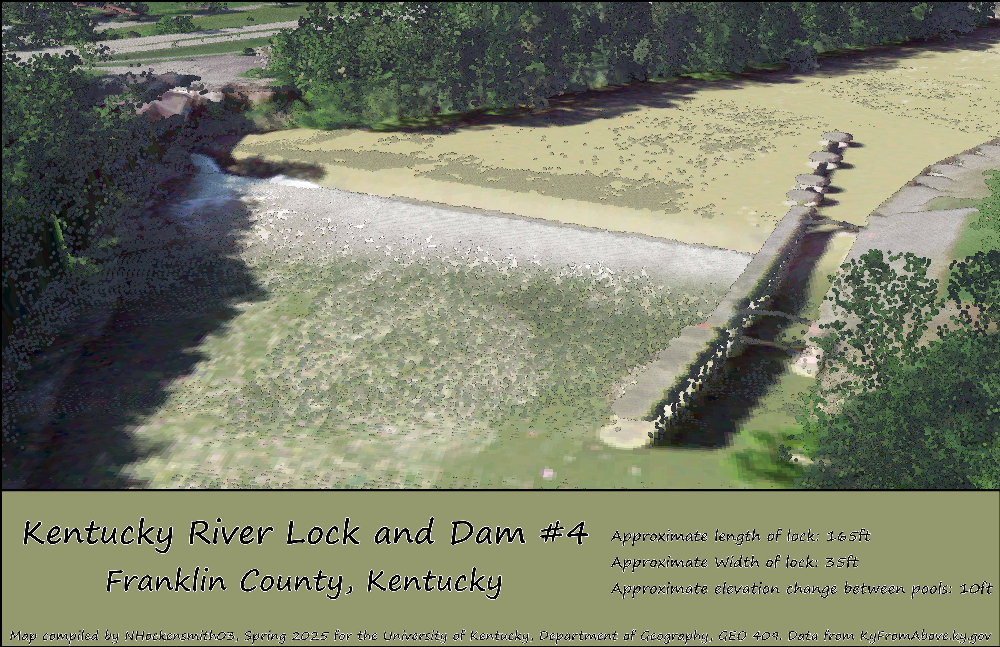
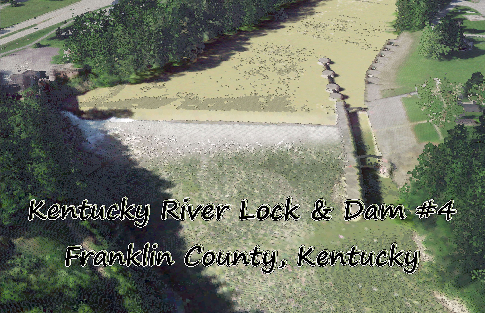

# Kentucky River Lock & Dam #4
 This website conatins maps made by NHockensmit03 for the University of Kentucky, Geography departments, GEO409 class. The maps are of Dam and Lock #4 on the Kentucky river located in Franklin  County, Kentucky.

#### The original lock and Dam #4 on the Kentucky River was built between the years 1836 to 1842 and was then rebult in 1882 by the Corp of Engineers. The Lock & Dam have since been repaired several time and are still currently operational to leasure boat traffic, though the locks were used until 2002 as a form of transportation of goods by barge. 

_Dam & Lock #4 on the Kentucky River in FrankLin County, Kentucky_ [Download_Map_PDF](KyRivLoc4_Map.pdf)

  
_[Click Here For Virtual Tour](https://youtu.be/S604rrTPV9w)_